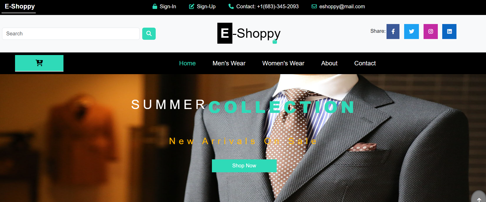
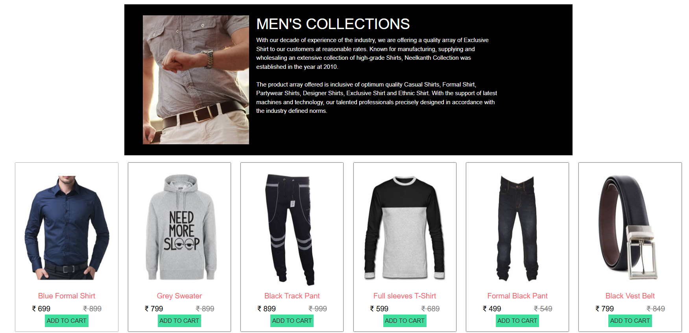
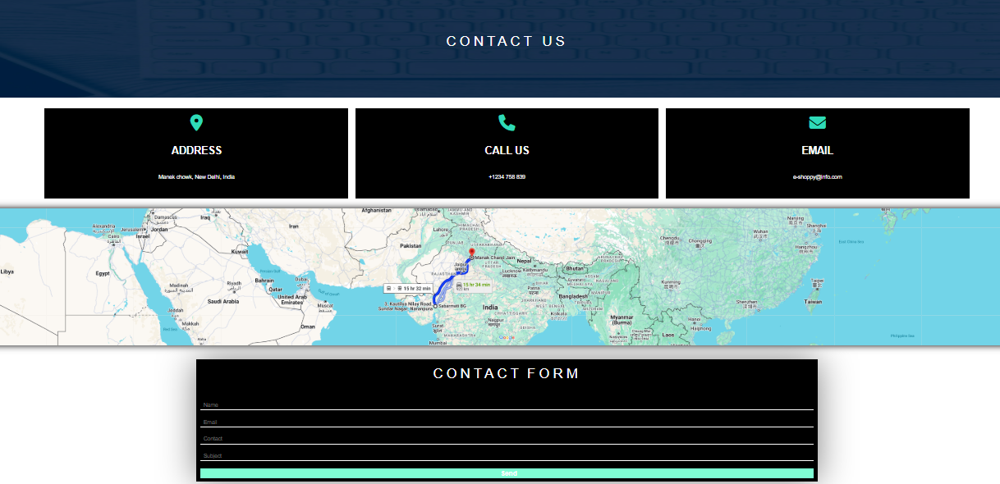
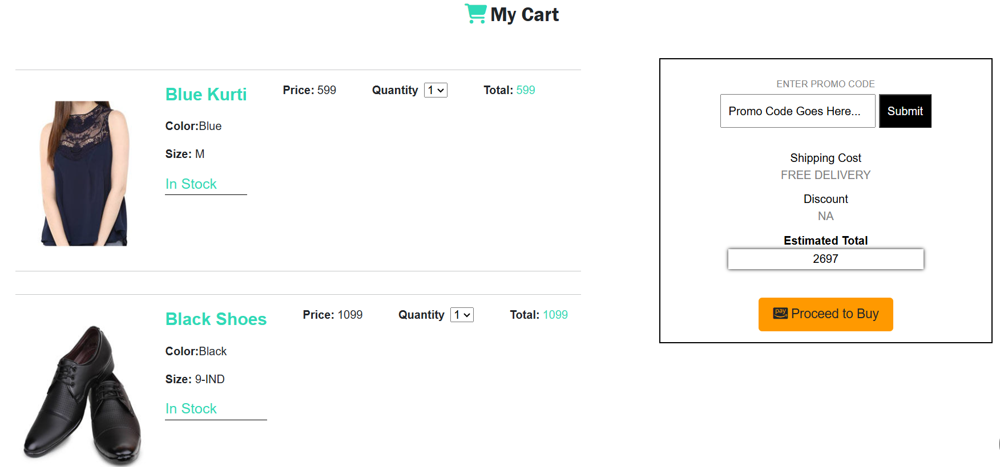

# E-Shoppy Website

- This is the final year b.tech project in which I have designed ecom website frontend with an aim to implement the UI/UX concepts learned in Human Computer Interaction subject and website is designed using HTML, CSS and Bootstrap with an aim to improve the add to cart conversion rates of the website.

- Website:- https://ecom-34z.pages.dev/

## Key Features

- Attractive layout
- Animations and beautiful user interface
- Easy to use
- Usage of HTML,CSS and Bootstrap

## Project Photos

- Landing Page
[](https://katherineoelsner.com/)

- Landing page hover effect
[](https://katherineoelsner.com/)

- Mens wear
[](https://katherineoelsner.com/)

- About page
[](https://katherineoelsner.com/)

- Contact page
[](https://katherineoelsner.com/)

- Add to cart
[](https://katherineoelsner.com/)

## Run Locally

Clone the project
```bash
  git clone https://github.com/NandishDPatel/BTechProject.git
```

Go to the project directory
```bash
  cd BTechProject
```

- After installing project and going into the project directory run code/index.html file by clicking open with live server in vs code and your will be up and running :)


